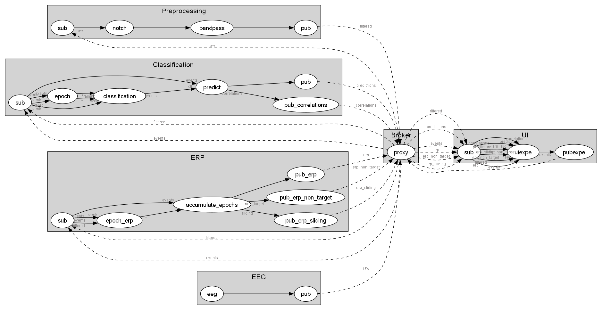

# Burst VEP

This Timeflux application is a proof-of-concept of the Burst VEP method.

## Installation

First install Timeflux and its depedencies in a new environment:

```bash
conda create --name timeflux python=3.10 pip pytables
conda activate timeflux
pip install timeflux timeflux_ui timeflux_dsp pyriemann imblearn
timeflux -v
```

Then simply clone this repository:

```bash
git clone https://github.com/timeflux/burst.git
```

## Stages, layouts, and tasks

The application life cycle has two main stages:

- The calibration procedure
- Zero or more evaluation tasks

These two stages can have different layouts (for example, one single target for the calibration stage and either the original 5-target layout, a simple 9-target grid, or the 11-class keyboard for the evaluation tasks). Currently, all the evaluation tasks must share the same layout.

Three task types are available:

- A cued task where participants are asked to activate the designated target
- A self-paced task
- A sequence task where the goal is to activate a sequence of targets identified on a virtual keyboard

Most of the times, tasks and layouts are independent. This is not always the case, though. For example, the sequence task is only available for the keyboard and simple layout.

## Configuration

The application can be fine-tuned in a number of ways.

### Environment

The [`.env`](https://github.com/timeflux/burst/blob/main/.env) file provides high-level configuration.

By default, a random signal is used in place of EEG data, so you can try the application without any additional hardware. For real EEG acquisition, you must provide your own `DEVICE.yaml` graph in the [`graphs`](https://github.com/timeflux/burst/tree/main/graphs) folder.

Currently, only the `riemann` machine learning pipeline is available.

| Setting | Description  | Default |
|---------|--------------|---------|
| DEVICE | EEG device | dummy |
| EPOCH | Epoch length, in seconds, used for classification | 0.25 |
| PIPELINE | Classification pipeline (riemann, eegnet) | riemann |
| CALIBRATION_LAYOUT | The layout used for calibration (single, simple, grid, keyboard) | single |
| TASK_LAYOUT | The layout used for the main task (simple, grid, keyboard) | simple |
| SEED | If set, the code generator will use this random seed for reproducibility purposes | |

Note that you can also set up environment variables [outside of an .env file](https://doc.timeflux.io/en/stable/usage/getting_started.html#environment).

### Burst codes

Burst codes are defined in a [hook](https://github.com/timeflux/burst/blob/main/hooks/pre.py). This allows the codes to be stored in an environment variable that can be reused in the graphs. By default, codes are generated dynamically for a length of 132 frames containing 6 bursts with a maximum jitter of 3 frames.

### Preprocessing

The default preprocessing consists of the following:

- Average rereferencement
- Notch filter at 50 Hz (IIR, order 3)
- Bandpass filter between 1 and 40 Hz (IIR, order 2)

It can be modified in the [`main.yaml`](https://github.com/timeflux/burst/blob/main/main.yaml) graph.

Individual epochs are scaled using the standard deviation of the training set. Class imbalance is handled through random undersampling.

### User interface

The application expects an dictionary of settings.

| Setting | Description  | Default |
|---------|--------------|---------|
| codes.calibration | The list of burst codes for the calibration layout (one per target) | |
| codes.task | The list of burst codes for the task layout (one per target) | |
| layouts.calibration | The layout for the calibration stage ('single', 'simple', 'keyboard') | single |
| layouts.task | The layout for the task stages ('simple', 'keyboard') | keyboard |
| calibration.blocks | The number of rounds during calibration | 5 |
| calibration.repetitions | The number of cycles for each target | 3 |
| calibration.active_only | Display only the current target and mask the others | false |
| calibration.duration_rest | The rest period before a new target is presented, in ms | 2000 |
| calibration.duration_cue_on | The duration of the cue | 1500 |
| calibration.duration_cue_off | The duration of the pause before the code starts flashing | 500 |
| task.cue.enable | `true` if the cued task must be enabled, `false` otherwise | `true` |
| task.cue.targets | The number of random targets or the list of targets to be cued | 10 |
| task.sequence.enable | `true` if the sequence task must be enabled, `false` otherwise | `true` |
| task.sequence.sequences | The number of random sequences or the list of sequences to be typed | 10 |
| task.sequence.cue_target | `true` if target cues must be enabled, `false` otherwise | `false` |
| task.sequence.cue_feedback | `true` if feedback cues must be enabled, `false` otherwise | `true` |
| run.duration_rest | The rest period before the free run begins, in ms | 2000 |
| run.duration_lock_on | The duration of the feedback when a prediction is received | 1500 |
| run.duration_lock_off | The rest period after the feedback | 500 |
| stim.type | The stimulus type ('gabord', 'ricker', 'face', 'plain') | gabor |
| stim.depth | The stimulus opacity (between 0 and 1) | 0.8 |
| colors.background | The background color | #202020 |
| colors.text | The text color | #FFFFFF |
| colors.cross | The fixation cross color | #FFFFFF |
| colors.target_off | The target color during the off-state | #797979 |
| colors.target_on | The target color during the on-state, if stim.type is 'plain' | #FFFFFF |
| colors.target_border | The border color | #000000 |
| colors.target_cue | The cue border color | blue |
| colors.target_success | The target color when the task is successful | green |
| colors.target_failure | The target color when the task failed | red |
| colors.target_lock | The prediction color | blue |

The default settings can be changed in the [`main.yaml`](https://github.com/timeflux/burst/blob/main/main.yaml) graph. Also see [`app.js`](https://github.com/timeflux/burst/blob/main/www/assets/js/app.js) for details.

#### HTML

Targets and layouts can be freely added in [`index.html`](https://github.com/timeflux/burst/blob/main/www/index.html).
Layouts are container divs with an id starting with `layout-`. Each target must have a `target` class. Targets are identified in DOM order for each layout (i.e. the first target in the `layout-simple` div in `index.html` will have the `0` id). There must be as many HTML elements as there are burst codes associated with the layout.

#### CSS

Each individual layout has an associated stylesheet. All the layouts are responsive, and will adjust to screen resizes according to a given ratio. The shape, position, and colors of the targets can be further adjusted in [`custom.css`](https://github.com/timeflux/burst/blob/main/www/assets/css/custom.css).

For example, to change the original 3:4 ratio of the _keyboard_ layout to a square:

```css
#layout-keyboard {
    aspect-ratio: 1 / 1;
}
```

Or, to change the diameter of the target in the _single_ layout:

```css
#layout-single .target {
    width: 100px;
    height: 100px;
}
```

#### Images

To create a new stimulus type, simply add a new image in [this folder](https://github.com/timeflux/burst/blob/main/www/assets/img/).

### Predictions

The application classifies single flashes. Epochs are triggered at each frame on 250ms windows. The classification pipeline computes xdawn covariances projected on the tangent space followed by a linear discriminant analysis. The resulting probabilities are [accumulated](https://github.com/timeflux/burst/blob/main/nodes/predict.py) in a circular buffer on which correlation analysis is performed. When enough confidence is reached for a specific target, a final prediction is made.

The accumulation engine is [configurable](https://github.com/timeflux/burst/blob/main/graphs/classification.yaml).

| Setting | Description  | Default |
|---------|--------------|---------|
| codes | The list of burst codes, one for each target | |
| min_buffer_size | Minimum number of predictions to accumulate before emitting a prediction | 30 |
| max_buffer_size | Maximum number of predictions to accumulate for each class | 200 |
| threshold | Minimum value to reach according to the Pearson correlation coefficient | .75 |
| delta | Minimum difference percentage to reach between the p-values of the two best candidates | .5 |
| recovery | Minimum duration in ms required between two consecutive epochs after a prediction | 300 |

Please note that default values are reasonnably suitable for random data. For real EEG data, the threshold should probably be raised.

## Running

Run the following:

```bash
timeflux -d main.yaml
```

You can monitor the EEG signal [here](http://localhost:8000/monitor/). The application is accessible at [this address](http://localhost:8000/app/).


Maximize your browser window to avoid distractions, and follow the instructions. The session includes the following steps:

- Fixation cross (to ensure that the monitor is directly facing the user)
- Calibration stage (required to compute the model)
- Self-paced selection (use left arrow to restart the calibration and right arrow to continue to the evaluation tasks)
- Zero or more evaluation tasks

When you are done, close the browser tab, and send the `Ctrl+C` command to Timeflux.

## Application schema



## Analysing

If anything goes wrong, logs can be found in the `log` folder.

For further analysis, data and events are recorded in the `data` folder.

### Load EEG data, events and metadata

```python
import pandas as pd
fname = "data/20231121-090341.hdf5"
raw = pd.read_hdf(fname, "raw")
filtered = pd.read_hdf(fname, "filtered")
predictions = pd.read_hdf(fname, "predictions")
events = pd.read_hdf(fname, "events")
config = events.loc[events['label'] == "session_begins"]["data"][0]
scores = events.loc[events['label'] == "task_ends"]["data"]
```

